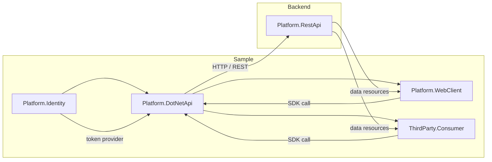

# DocuwareArchitect Sample

This repository is a product-style architecture sample inspired by DocuWare.
It is designed for interview presentation and demonstrates how a real platform can separate:

- service layer (`REST API`)
- SDK/client wrapper (`.NET API`)
- platform/UI integration
- third-party consumer integration
- identity/token handling

## Architecture Overview



> Note: this diagram describes the current sample implementation. In a real DocuWare browser WebClient, the UI is typically closer to a frontend client calling `Platform.RestApi` directly, while the `.NET API` remains an optional SDK wrapper for third-party .NET applications.

## Component Responsibilities

- **Platform.Identity**: simplified identity provider and token service. In a real product, this would be replaced with OAuth/OpenID Connect or a centralized token service.
- **Platform.RestApi**: core REST platform exposing document resources and platform APIs.
- **Platform.DotNetApi**: .NET SDK wrapper that encapsulates REST requests and exposes a developer-friendly client interface (`IDocuwareClient`).
- **Platform.WebClient**: MVC platform application in this sample that consumes `Platform.DotNetApi` to demonstrate a platform UI built on the SDK.
- **ThirdParty.Consumer**: external consumer app simulating a third-party integration that references the SDK DLL and calls the platform via client methods.

> Note: in a real DocuWare browser WebClient, the UI often behaves more like a frontend client calling the platform REST API directly, while the `.NET API` remains an optional SDK layer for external .NET integrations.

## Design Principles

- **Separation of concerns**: backend service, SDK wrapper, platform UI, and third-party consumer are clearly separated.
- **SDK-before-UI**: third-party applications and platform UIs call the same SDK layer, rather than duplicating REST logic.
- **Product-style integration**: the `.NET API` acts as the stable integration contract for partners and internal consumers.
- **Pluggable identity**: identity is separated from platform operations, laying the groundwork for OAuth or token-based auth.

## Running the Sample

### Build all projects

```powershell
dotnet build
```

### Run with Docker Compose

```powershell
.\start-docker-with-swagger.ps1 -Build
```

This script builds and starts all services, then opens the Swagger UI for:

- REST API: `http://localhost:5000/swagger`
- WebClient: `http://localhost:5001/swagger`
- ThirdParty Consumer: `http://localhost:5002/swagger`

### Run projects individually

```powershell
dotnet run --project Platform.RestApi\Platform.RestApi.csproj
dotnet run --project Platform.WebClient\Platform.WebClient.csproj
dotnet run --project ThirdParty.Consumer\ThirdParty.Consumer.csproj
```

## Key Endpoints

- `GET /api/documents` — read documents
- `POST /api/documents` — create a document
- `GET /api/documents-from-factory` — demo of factory-style SDK usage in the third-party consumer

## Why this is interview-ready

This sample shows a real product mindset:

- a scalable backend service
- a reusable SDK abstraction layer
- platform-facing UI built on the SDK
- a separate third-party integration surface
- a dedicated identity/token module

It is not presented as a pure learning toy, but as a simplified demonstration of the same design ideas you would see in a production platform.
