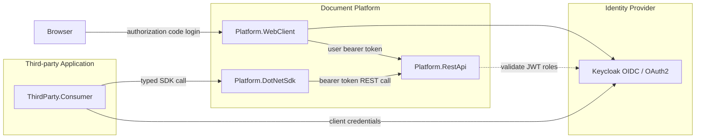
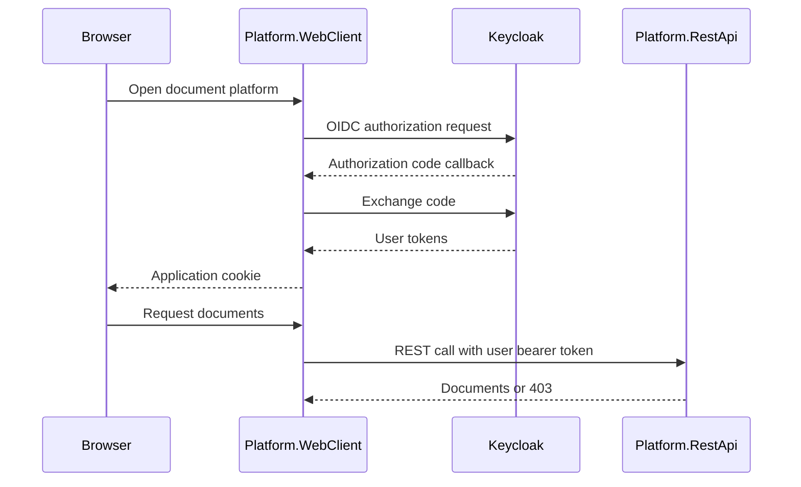
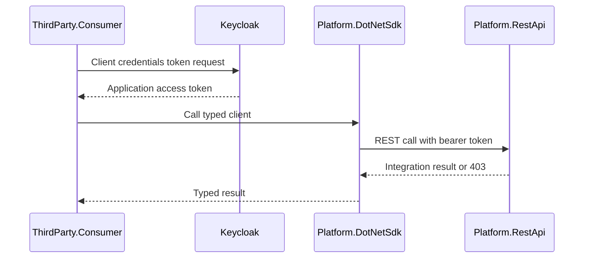

# Document Platform Integration

Document Platform Integration models a REST-first document platform with a .NET SDK wrapper, a server-rendered platform web client, a third-party consumer application, and a Keycloak-backed OAuth2/OIDC identity boundary.

The project focuses on integration shape rather than vendor internals: first-party browser operations call the REST platform through a web client, while external .NET integrations use a typed SDK over the same REST API.

## Core Capabilities

- REST API as the primary document platform boundary.
- Platform-provided .NET SDK wrapper over REST endpoints.
- Server-rendered web client using OIDC authorization code flow and server-side cookies.
- Third-party consumer app using client credentials and SDK-based integration.
- Keycloak realm with users, clients, roles, and service account configuration.
- Docker Compose orchestration for identity, platform API, web client, and consumer app.

## Architecture



## Authentication Flows

### Web Client User Flow



### Third-party Integration Flow



## Component Responsibilities

| Component | Responsibility |
| --- | --- |
| `Platform.RestApi` | protected document API and role-based authorization |
| `Platform.DotNetSdk` | typed .NET wrapper over REST calls |
| `Platform.WebClient` | first-party web UI with server-side OIDC session |
| `ThirdParty.Consumer` | external integration app using SDK and client credentials |
| `identity/keycloak` | realm import with clients, users, roles, and service account setup |

## Run Locally

Build all projects:

```powershell
dotnet build DocumentPlatformIntegration.slnx
```

Run the full Docker Compose stack:

```powershell
.\start-docker-with-swagger.ps1 -Build
```

Local URLs:

| Service | URL |
| --- | --- |
| REST API Swagger | http://localhost:5000/swagger |
| WebClient UI | http://localhost:5001 |
| ThirdParty Consumer Swagger | http://localhost:5002/swagger |
| Keycloak Admin Console | http://localhost:8080/admin/master/console/ |

Keycloak admin credentials: `admin / admin`.

Imported test accounts:

| Account | Password | Access |
| --- | --- | --- |
| `architect.user` | `password` | standard documents |
| `architect.admin` | `password` | standard and confidential documents |
| `thirdparty-consumer` | client secret | integration export |

## Verify

Expected results:

- `architect.user` can view standard documents.
- `architect.admin` can view standard and confidential documents.
- `thirdparty-consumer` client token can call `/api/documents/integration-export`.
- `thirdparty-consumer` client token receives `403` for user-only document endpoints.
