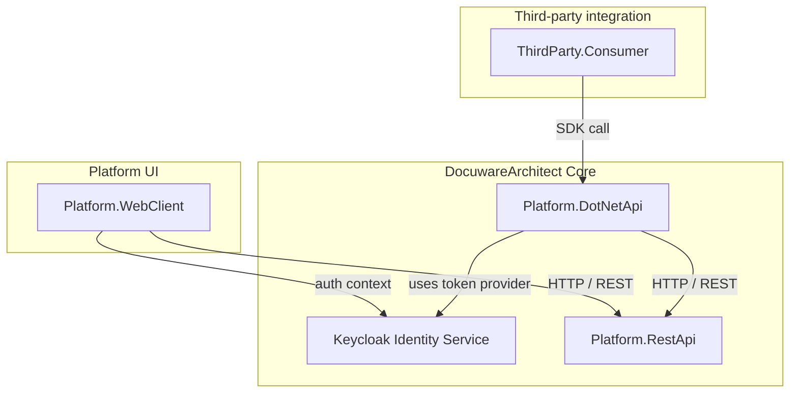

# DocuwareArchitect

This repository models a DocuWare-style integration architecture with a
REST-first backend, an optional .NET SDK wrapper, a platform-facing web client,
a third-party consumer application, and a Keycloak-backed identity boundary.

The goal is not to reproduce DocuWare internals. The project focuses on the
main integration shape of a document platform: browser-facing platform
operations use REST endpoints directly, while external .NET integrations can
use a typed client library over the same REST API.

## Architecture Overview



> Note: this diagram describes the current implementation. The web client calls
> the REST API directly, while the `.NET API` remains an optional SDK wrapper
> for third-party .NET applications.

## Component Responsibilities

- **Keycloak Identity Service**: OAuth2/OpenID Connect identity boundary used by both the browser-facing web client path and the SDK-based integration path.
- **Platform.RestApi**: core REST platform exposing document resources and platform APIs. Document endpoints are protected with JWT bearer authentication issued by Keycloak.
- **Platform.DotNetApi**: .NET SDK wrapper that encapsulates REST requests and exposes a developer-friendly client interface (`IDocuwareClient`). The SDK accepts a host-provided token provider and forwards the resulting bearer token to the REST API.
- **Platform.WebClient**: MVC platform application that calls `Platform.RestApi` directly, similar to a browser-hosted product UI using platform endpoints.
- **ThirdParty.Consumer**: external consumer app simulating a third-party integration that references the SDK DLL and calls the platform through client methods.

## Architecture Coverage

- A core REST API as the main platform boundary.
- A typed .NET client library over the REST API.
- A first-party web client that calls REST endpoints directly.
- A third-party .NET consumer that calls the same REST platform through the SDK and supplies its own OAuth token provider.
- Identity/token separation from platform operations.
- Dependency-injected HTTP clients and configuration-driven service endpoints.
- Docker Compose orchestration for the platform services.
- A document workflow slice: list documents, create documents, and consume them from another application.

## Design Principles

- **Separation of concerns**: backend service, SDK wrapper, platform UI, and third-party consumer are clearly separated.
- **REST-first integration**: the REST API is the core platform contract.
- **Optional SDK layer**: the `.NET API` provides a typed wrapper for .NET applications without replacing the REST API.
- **Product-style boundaries**: each project has a focused role and communicates through explicit contracts.
- **Pluggable identity concept**: identity is separated from platform operations, laying the groundwork for OAuth or token-based auth.

## Scope

This architecture model currently implements document operations only. Areas
such as metadata, tasks, roles, groups, annotations, workflow activities,
document validation, and collaboration are outside the current scope.

Authentication is represented as a separate boundary backed by Keycloak. The
current repository includes a realm import with clients for the web client, REST
API, and SDK path. REST API token validation is enabled, and the SDK accepts a
host-managed access token provider. WebClient OIDC cookie login is the next
integration step.

## Running the Architecture

### Build all projects

```powershell
dotnet build
```

### Run with Docker Compose

```powershell
.\start-docker-with-swagger.ps1 -Build
```

This script builds and starts all services, then opens:

- REST API Swagger: `http://localhost:5000/swagger`
- WebClient UI: `http://localhost:5001`
- ThirdParty Consumer Swagger: `http://localhost:5002/swagger`
- Keycloak Admin Console: `http://localhost:8080/admin/master/console/`

Keycloak local admin credentials for the Admin Console:

- Username: `admin`
- Password: `admin`

Imported realm:

- Realm: `docuware-architect`
- Web client: `platform-webclient`
- SDK client: `platform-dotnet-sdk`
- REST API client: `platform-rest-api`
- Realm test user for future WebClient/OIDC login: `architect.user` / `password`

### Run projects individually

```powershell
dotnet run --project Platform.RestApi\Platform.RestApi.csproj
dotnet run --project Platform.WebClient\Platform.WebClient.csproj
dotnet run --project ThirdParty.Consumer\ThirdParty.Consumer.csproj
```

## Key Endpoints

- `GET /api/auth/token` - get a Keycloak client credentials token for local API verification
- `GET /api/documents` - read documents
- `POST /api/documents` - create a document
- `GET /api/documents-from-factory` - demo of SDK usage in the third-party consumer

## Why this architecture exists

This project is intended to show practical platform design boundaries:

- a backend service with a clear HTTP boundary
- a reusable SDK abstraction layer
- a platform-facing UI
- a separate third-party integration surface
- a dedicated OAuth2/OpenID Connect identity boundary

It is a scoped architecture implementation, not a complete document management
system.
