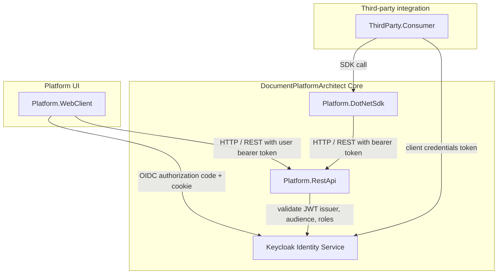
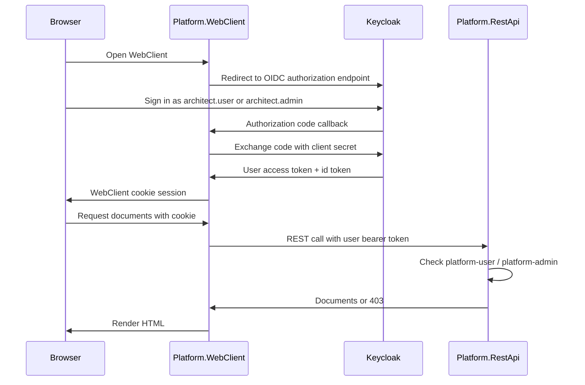
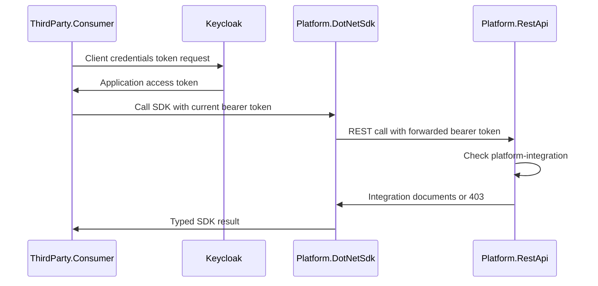

# DocumentPlatformArchitect

This repository models an enterprise document platform integration architecture
with a REST-first backend, an optional .NET SDK wrapper, a platform-facing web
client, a third-party consumer application, and a Keycloak-backed identity
boundary.

The goal is not to reproduce vendor internals. The project focuses on the
main integration shape of a document platform: browser-facing platform
operations use REST endpoints directly, while external .NET integrations can
use a typed client library over the same REST API.

## Architecture Overview



> Note: this diagram describes the current implementation. The web client uses
> OIDC authorization code flow with a server-side cookie session. The `.NET SDK`
> remains an optional wrapper for third-party .NET applications.

## Authentication Flows

### WebClient user login



In this flow, the browser does not call `Platform.RestApi` directly and does
not hold the access token. The token is handled server-side by
`Platform.WebClient`.

### Third-party machine integration



In this flow, the token represents the registered third-party application, not
an interactive user.

## Component Responsibilities

- **Keycloak Identity Service**: OAuth2/OpenID Connect identity boundary used by both the browser-facing web client path and the SDK-based integration path.
- **Platform.RestApi**: core REST platform exposing document resources and platform APIs. Document endpoints are protected with JWT bearer authentication issued by Keycloak.
- **Platform.DotNetSdk**: .NET SDK wrapper that encapsulates REST requests and exposes a developer-friendly client interface (`IPlatformClient`). The SDK accepts a host-provided token provider and attaches the returned bearer token to REST API requests. It does not own the OAuth client registration.
- **Platform.WebClient**: MVC platform application using OIDC authorization code login, a server-side cookie session, and user access tokens when calling `Platform.RestApi`.
- **ThirdParty.Consumer**: external consumer app simulating a third-party integration that references the SDK DLL and calls the platform through client methods.

## Architecture Coverage

- A core REST API as the main platform boundary.
- A typed .NET client library over the REST API.
- A first-party web client that signs users in through authorization code flow and calls REST endpoints with user access tokens.
- A third-party .NET consumer that obtains an application token through its own OAuth client registration and calls the same REST platform through the SDK.
- Identity/token separation from platform operations.
- Dependency-injected HTTP clients and configuration-driven service endpoints.
- Docker Compose orchestration for the platform services.
- A document workflow slice: list documents, create documents, and consume them from another application.

## Design Principles

- **Separation of concerns**: backend service, SDK wrapper, platform UI, and third-party consumer are clearly separated.
- **REST-first integration**: the REST API is the core platform contract.
- **Optional SDK layer**: the `.NET SDK` provides a typed wrapper for .NET applications without replacing the REST API.
- **Product-style boundaries**: each project has a focused role and communicates through explicit contracts.
- **Pluggable identity concept**: identity is separated from platform operations through OAuth2/OpenID Connect and JWT bearer validation.

## Scope

This architecture model currently implements document operations only. Areas
such as metadata, tasks, roles, groups, annotations, workflow activities,
document validation, and collaboration are outside the current scope.

Authentication is represented as a separate boundary backed by Keycloak. The
current repository includes a realm import with clients for the web client, REST
API, and a third-party consumer application. REST API token validation is
enabled. The web client uses OIDC authorization code flow and stores the user
session in an application cookie. The SDK delegates token resolution to the host
application; the current third-party consumer reads a bearer token from the
incoming request and forwards it through the SDK.

## Running the Architecture

### Build all projects

```powershell
dotnet build
```

### Run with Docker Compose

```powershell
.\start-docker-with-swagger.ps1 -Build
```

This script builds and starts all services, then opens:

- REST API Swagger: `http://localhost:5000/swagger`
- WebClient UI: `http://localhost:5001`
- ThirdParty Consumer Swagger: `http://localhost:5002/swagger`
- Keycloak Admin Console: `http://localhost:8080/admin/master/console/`

Docker Compose uses these public URLs:

- WebClient UI: `http://localhost:5001`
- REST API Swagger: `http://localhost:5000/swagger`
- ThirdParty Consumer Swagger: `http://localhost:5002/swagger`
- Keycloak: `http://localhost:8080`

Keycloak local admin credentials for the Admin Console:

- Username: `admin`
- Password: `admin`

Imported realm:

- Realm: `document-platform`
- Web client: `platform-webclient`
- Third-party OAuth client: `thirdparty-consumer`
- REST API client: `platform-rest-api`
- Realm user: `architect.user` / `password` with `platform-user`
- Realm admin: `architect.admin` / `password` with `platform-user` and `platform-admin`
- Service account role: `thirdparty-consumer` has `platform-integration`

For local API verification, use the ThirdParty Consumer Swagger UI to request a
client credentials token. Paste the returned bearer token into the Swagger
Authorize dialog before calling SDK-backed integration endpoints.

Application-level verification endpoints are also available:

- `POST /api/token/client` returns a token for `thirdparty-consumer`
- `GET /api/documents/integration-export` allows `platform-integration`
- `GET /api/documents` still requires a user role
- `GET /api/documents/confidential` still requires `platform-admin`

Expected result through ThirdParty Consumer Swagger:

- `thirdparty-consumer` client token -> `/api/documents/integration-export` returns `200`
- `thirdparty-consumer` client token -> `/api/documents` returns `403`
- `thirdparty-consumer` client token -> `/api/documents/confidential` returns `403`

Expected result through Platform WebClient:

- `architect.user` / `password` -> standard documents visible, confidential documents show an access warning
- `architect.admin` / `password` -> standard and confidential documents visible

### Run projects individually

```powershell
dotnet run --project Platform.RestApi\Platform.RestApi.csproj
dotnet run --project Platform.WebClient\Platform.WebClient.csproj
dotnet run --project ThirdParty.Consumer\ThirdParty.Consumer.csproj
```

When running projects individually, the local development URLs are:

- WebClient UI: `http://localhost:5167`
- REST API Swagger: `http://localhost:5079/swagger`
- ThirdParty Consumer Swagger: `http://localhost:63293/swagger`
- Keycloak remains `http://localhost:8080`

## Key Endpoints

- REST API `GET /api/documents` - read documents
- REST API `POST /api/documents` - create a document
- REST API `GET /api/documents/confidential` - read admin-only confidential documents
- REST API `GET /api/documents/integration-export` - read integration export documents with an application token
- WebClient `GET /` - sign in through Keycloak and read documents through the REST API
- WebClient `GET /account/login` - start OIDC authorization code login
- WebClient `POST /account/logout` - clear the local cookie session and sign out from Keycloak
- ThirdParty Consumer `POST /api/token/client` - get a client credentials token for Swagger testing
- ThirdParty Consumer `GET /api/documents` - call the REST API through the SDK using the supplied bearer token
- ThirdParty Consumer `POST /api/documents` - create a document through the SDK using the supplied bearer token
- ThirdParty Consumer `GET /api/documents/confidential` - call the admin-only document endpoint through the SDK
- ThirdParty Consumer `GET /api/documents/integration-export` - call the integration export endpoint through the SDK

## Why this architecture exists

This project is intended to show practical platform design boundaries:

- a backend service with a clear HTTP boundary
- a reusable SDK abstraction layer
- a platform-facing UI
- a separate third-party integration surface
- a dedicated OAuth2/OpenID Connect identity boundary

It is a scoped architecture implementation, not a complete document management
system.
